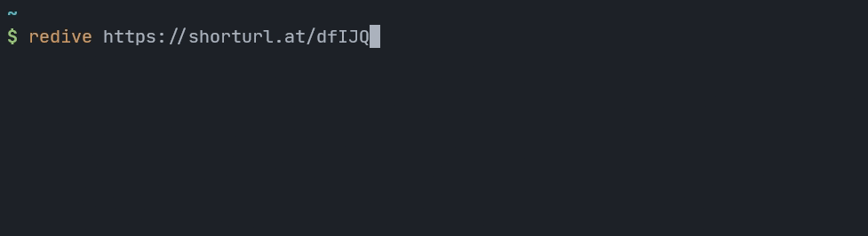

# redive

> Trace URL redirections in the terminal.



## Installation and Usage

Install the Rust Toolchain and then

```sh
cargo install --git https://github.com/neelkarma/redive
```

After that, you can use the `redive` command to run redive, as shown in the gif
above.
